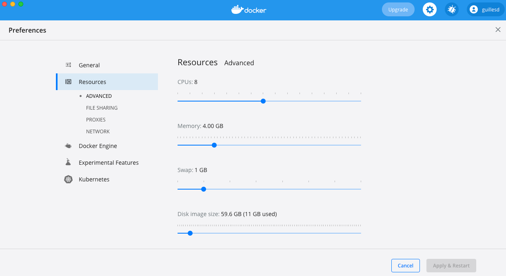
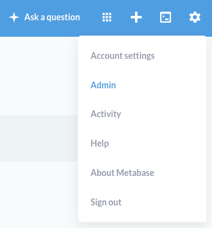
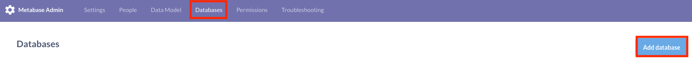
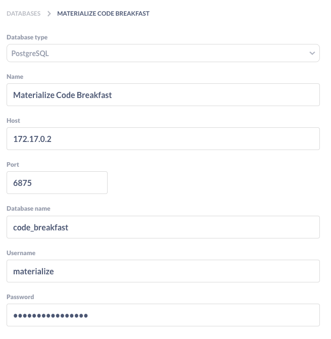

# Runbook of the code breakfast
*Just in case your local Docker installation is underprovisioned, this are my Docker resource settings for this demo:*

## Materialize setup
1. Make sure Docker is running in your machine.
2. Install libpq (to get the psql CLI) <br>
    a. Mac (with Homebrew)
```bash
# install libpq
brew install libpq
# export the location of libpq's bin to PATH in your .bash_profile file
vim .bash_profile
# then copy this at the end
export PATH=$PATH:/usr/local/Cellar/libpq/<your_libpq_version>/bin
```

&nbsp;&nbsp;&nbsp;&nbsp;&nbsp;&nbsp;&nbsp;&nbsp;
b. Linux

```bash
sudo apt-get install postgresql-client
```

&nbsp;&nbsp;&nbsp;&nbsp;&nbsp;&nbsp;&nbsp;&nbsp;
c. Windows<br>
* Download your desired version from [Enterprise DB](https://www.enterprisedb.com/downloads/postgres-postgresql-downloads)
* In the prompted installation GUI, when asked to *Select Components*, select only *Command Line Tools*
* Then add the location of the bin (usually C:\Program Files\PostgreSQL\<your_pg_version>\bin) to PATH, either by using the Windows GUI or add it only for the current CMD session by executing:
```powershell
set PATH=%PATH%;C:\Program Files\PostgreSQL\<your_pg_version>\bin
```
You can check that everything is working by running `psql --help`

3. Run the following command in your terminal. This will both download the Materialize image and run the container.
```bash
docker run -p 6875:6875 --name materialize materialize/materialized:v0.7.2
```
4. Then run the following from your terminal to connect to Materialize through the CLI:
```bash
psql -U materialize -h localhost -p 6875 materialize
```
*I prepared this tutorial with version 0.7.3, although the latest is 0.8.0*
## Metabase setup
Open another terminal and make some simple Docker magic:
```bash
docker run -d -p 3000:3000 --name metabase metabase/metabase
```
## Create a database and schema
1. Go back to your Materialize terminal. If you closed it, just run:
```bash
psql -U materialize -h localhost -p 6875 materialize
```
2. Copy this SQL statement:
```sql
CREATE DATABASE IF NOT EXISTS code_breakfast;
CREATE SCHEMA IF NOT EXISTS code_breakfast.dummy_schema;
```

## Create connection from Metabase to Materialize
1. Open metabase in the browser via the Docker GUI or typing `localhost:3000`
2. Click on the settings icon on the top right and then click on *Admin*. This will take you to Metabase's Admin page. <br>

3. On the top menu bar select *Databases* and then click on the button *Add database* on the top right corner. <br>

4. In a clean terminal, run the following to get the IP address of Materialize (if your container id is different from *materialize* then type your container id instead):
```bash
docker inspect materialize | grep "IPAddress"
```
5. Fill the settings for the connection like indicated in this image. Make sure to use the IP Address retrieved in the previous step as host and change the port if you chose a different one. **Note that the default user *materialize* does not require a password, ergo leave this field blank.** <br>


## Connect to a Pubnub source and map this to a tabular view
We are all set! Let's start ingesting data!!
1. The following code snippet connects to a stream of data from [Pubnub](https://www.pubnub.com/developers/realtime-data-streams/):
```sql
CREATE MATERIALIZED SOURCE code_breakfast.dummy_schema.market_orders_raw 
FROM PUBNUB
    SUBSCRIBE KEY 'sub-c-4377ab04-f100-11e3-bffd-02ee2ddab7fe'
    CHANNEL 'pubnub-market-orders';
```
2. This source doesn't have a tabular format yet, so we need to create a view on top and map the key/value pairs from the objects to the attributes of a table:
```sql
CREATE VIEW code_breakfast.dummy_schema.market_orders AS
    SELECT
        val->>'symbol' AS symbol,
        (val->'bid_price')::float AS bid_price,
        (val->'order_quantity')::int AS quantity,
        val->>'trade_type' AS trade_type,
        (val->'timestamp')::int AS timestamp_col
    FROM (SELECT text::jsonb AS val FROM code_breakfast.dummy_schema.market_orders_raw);
```

## Build a materialized view

## Create a dashboard in Metabase

## Go for your
Now it's up to you to decide which kind of insights you want to get out of the data and how to visualize those!